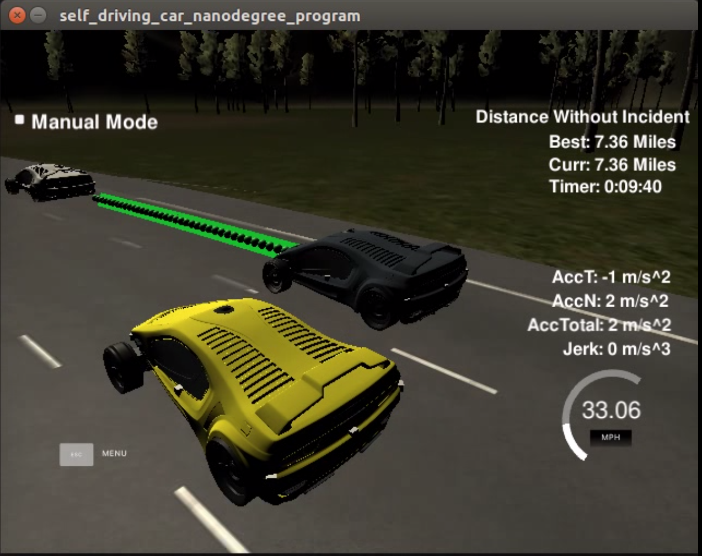

# CarND Path Planning Project

## Goals
The goal of this project was to explore implementing a cost function to allow your vehicle to safely, and efficiently, navigate a highway simulation with other vehicles on the road using a combination of localization data of the your position and the position of cars around you, and a set of waypoints defining the center of the highway all around the map. Using both real world and Frenet coordinates, the goal is to program the car to safely drive around the map while maintaining lane center, unless changing lanes, and without colliding with any surrounding vehicles. Restrictions are defined that limit the maximium acceleration (10m/s^2) and jerk (10m/s^3) as to provide the riders with a comfortable trip. The [rubric](https://review.udacity.com/#!/rubrics/1020/view) explains the requirements for the project.

## Getting Started
View the project outline and how to download and bringup the source code from the repository [here](https://github.com/djiglesias/CarND-Path-Planning-Project/blob/master/overview.md). Once downloaded, the following commands can be run to compile the application.

1. Clone this repo.
2. Make a build directory: `mkdir build && cd build`
3. Compile: `cmake .. && make`
4. Run it: `./path_planning`.

## Lane Keep Assist
The first step of the project was to get the car to drive forward and follow the lane on the road without breaking the rules of the project such as acceleration, jerk, and max speed limit. Thankfully the course provides a detailed tutorial for this section and demonstrates how to calculate a vector of waypoints...

## Adjust Speed with Lead

 

## Cost Function

 

